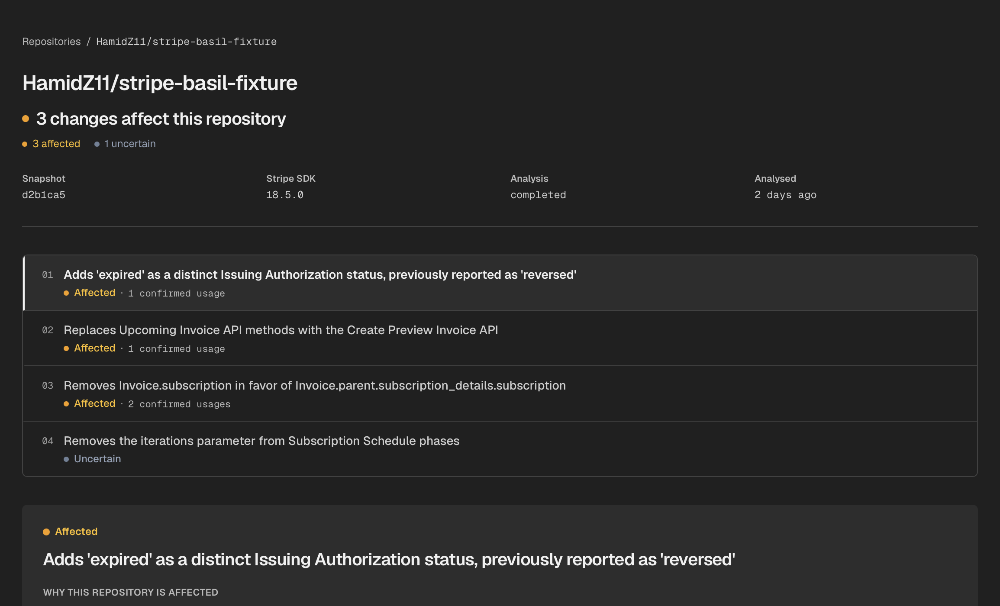
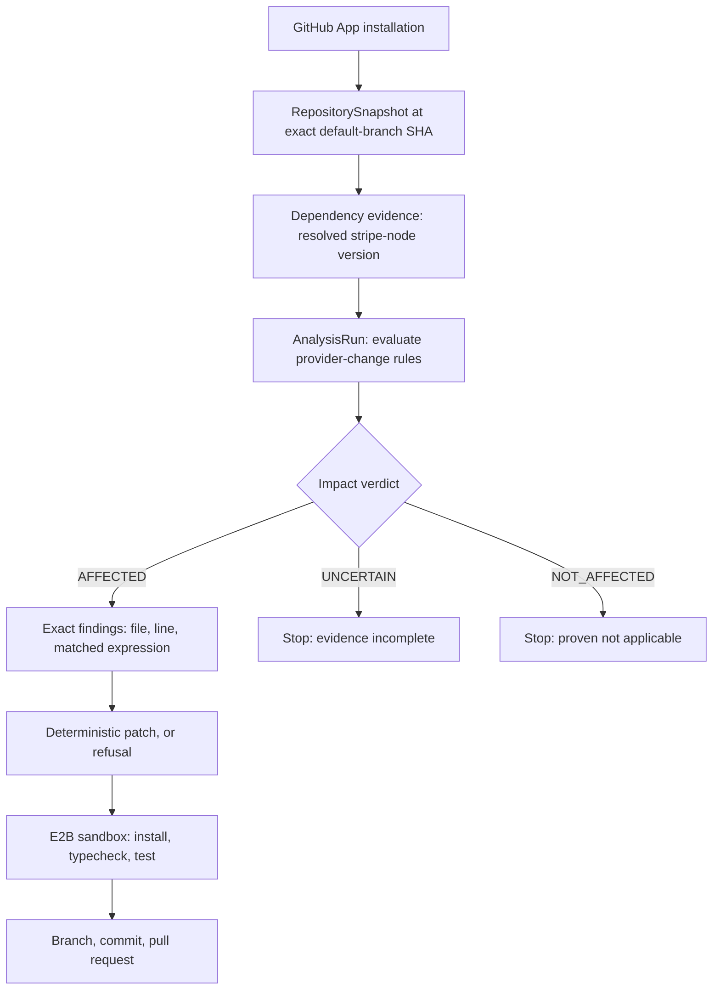
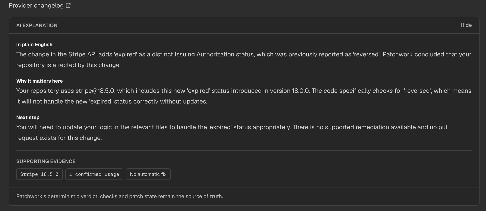
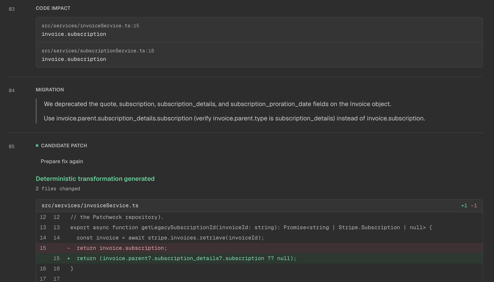

# Patchwork

Patchwork detects when a third-party API change affects a specific repository, proves the exact
usages, applies a deterministic migration where it can prove one is safe, verifies the result in an
isolated sandbox, and opens the pull request.

Current scope is deliberately narrow: GitHub, Stripe, TypeScript, `stripe-node`, one repository at a
time.



## Why Patchwork

A provider changelog tells you what changed. It cannot tell you:

- whether your repository uses the affected API at all,
- where that usage is,
- whether the version actually installed in your lockfile makes the change applicable,
- whether a safe migration exists for your specific call shape,
- whether the migrated code still builds and passes its tests.

Every one of those is a question about your repository, not the provider's. Patchwork answers them
in order, and refuses to answer the ones it cannot prove.

## How it differs from Dependabot

They solve adjacent problems and the distinction is categorical, not competitive.

Dependabot operates on **dependency versions**: package X has a newer release Y, here is the bump.
It is excellent at that and Patchwork does not attempt it.

Patchwork operates on **semantic API changes**: this specific provider change applies to the version
you have installed, your repository uses it at `src/services/invoiceService.ts:15`, this is the
required migration, here is a deterministic patch, and here is the sandbox run proving it still
builds.

The distinction from a general coding agent is the trust model. A coding agent is asked to decide
what changed and to write the fix. In Patchwork the deterministic engine decides applicability and
impact, and a language model is never trusted to determine truth — it only rewrites established
evidence into plain English.

## End-to-end flow



Explanations are an optional, separate read-only layer over any `AFFECTED` or `UNCERTAIN`
assessment. They never participate in the flow above.

## Impact engine

The core of the project. Every assessment is anchored to one `RepositorySnapshot` at one exact Git
SHA, so a verdict is always a statement about a specific commit rather than "the repository".

1. **Applicability** — the `stripe-node` version is resolved from the lockfile, not the range
   declared in `package.json`, per workspace.
2. **Candidate discovery** — lexical scanning narrows the search. It is never the proof.
3. **Semantic resolution** — findings come from the TypeScript Compiler API (`Program` /
   `TypeChecker`), so a match is a reference the compiler agrees is the affected symbol. Three
   predicate kinds are implemented: member access, call-argument property, and literal comparison.
4. **Verdict** — one of three states, with the third carrying the weight.

The invariant that shapes the whole engine:

> `AFFECTED` requires positive evidence. `NOT_AFFECTED` requires explicit negative proof.
> Anything unresolved, unknown, dynamic, or unsupported becomes `UNCERTAIN`.

Failure to prove impact is never evidence of safety. An unresolved import, an unknown version or a
failed analysis returns `UNCERTAIN` rather than a confident guess in either direction.

Rules are validated against a benchmark corpus (`pnpm benchmark`) split three ways: a **control**
corpus of fixtures shaped around each predicate, a **realistic** corpus of ordinary production
TypeScript patterns not shaped around the analyser's own capabilities, and a **historical** corpus
reconstructed from real public GitHub repositories at the commit before a real Stripe migration. The
suite gates on two numbers that must stay at zero — false `NOT_AFFECTED` results and unsafe
certainty — because those are the failures that would matter.

## Deterministic remediation

Patchwork does not ask a model to rewrite your code.

For a migration shape with an explicitly implemented, reviewed transformation, it performs a
deterministic source rewrite driven by static analysis:

```ts
// before
return invoice.subscription;

// after
return invoice.parent?.subscription_details?.subscription ?? null;
```

If it cannot prove the rewrite is value-preserving for the specific call shape it is looking at, it
refuses the whole attempt rather than emitting a partial patch. Refusal is a supported outcome.

That standard is why only one of the four implemented rules currently has a recipe. The other three
were each evaluated and rejected with a recorded reason — for example, the Upcoming Invoice
migration has no 1:1 argument mapping, and the Issuing Authorization change is an enum addition
requiring a business-logic decision rather than a mechanical rewrite. See
[`apps/api/src/remediation/registry.ts`](apps/api/src/remediation/registry.ts).

## Verification and publishing

A generated patch is a proposal, not a result.

Patched code is executed in an **isolated E2B sandbox** — `install`, `typecheck` and `test` using
the repository's own lockfile, TypeScript configuration and test command. Only a run that actually
passed can authorise publication. A step that did not run is recorded as not run; it is never
reported as passing.

Publishing creates a branch from the exact analysed commit, commits as the Patchwork GitHub App, and
opens a pull request. **Patchwork never merges and never deploys.**

## AI explanations

> Patchwork proves. AI explains.



The verdict, findings, applicability evidence and patch state are all decided before a model is
involved. The explanation layer receives a small server-built projection of that already-established
evidence — roughly a kilobyte of structured facts, never the repository, never source files, never a
credential — and returns a strict structured response that is schema-validated before it is stored.

Explanations are optional, generated on request, and cached against a hash of the exact evidence
they were written from, so a changed verdict regenerates rather than serving stale copy. The model
cannot change a verdict, claim a check ran, or assert a fix exists. If `OPENAI_API_KEY` is absent,
the endpoint reports itself unavailable and nothing else in the product changes.

## Architecture

A modular monolith across three processes ([ADR-001](docs/adr/0001-modular-monolith-processes.md)).

```
apps/
  web/      Next.js — public landing page, authenticated product UI
  api/      Fastify — auth, GitHub, analysis, impact, remediation, explanations
  worker/   Long-running poller — sandbox verification and PR publishing

packages/
  config/   Shared validated environment configuration
  db/       PostgreSQL access (Drizzle) and migrations
  github/   GitHub App auth and API client boundary
  archive/  Safe repository-archive extraction
```

Background work is a **PostgreSQL-backed queue** — `SELECT … FOR UPDATE SKIP LOCKED` over the
`verification_runs` and `pull_request_attempts` tables — not Redis or a separate broker. One
datastore, transactional with the rows the jobs are about.

### The trust boundary

Repository code never executes in the API or worker process. Only the sandbox runs it, and
installing dependencies is treated as untrusted code execution rather than a setup step.

The sandbox receives `{ CI: '1', NODE_ENV: 'test' }` and nothing else. It never receives the GitHub
installation token, the App private key, database credentials, the OpenAI key, or the E2B key. See
[docs/security.md](docs/security.md).

## Deterministic diff



## Tech stack

| Area         | Choice                                                               |
| ------------ | -------------------------------------------------------------------- |
| Frontend     | Next.js 16, React 19, Tailwind CSS 4, TypeScript                     |
| API          | Fastify 5, TypeScript, Zod                                           |
| Data         | PostgreSQL 16, Drizzle ORM                                           |
| Analysis     | TypeScript Compiler API (`Program` / `TypeChecker`)                  |
| Sandbox      | E2B                                                                  |
| Integrations | GitHub App (OAuth + installation tokens), OpenAI (explanations only) |
| Tooling      | pnpm workspaces, Turborepo, Vitest, ESLint, Prettier, GitHub Actions |

## Scope and limitations

Deliberate constraints, not omissions:

- GitHub only; no GitLab or Bitbucket.
- Stripe only, via four implemented provider-change rules.
- TypeScript only, `stripe-node` only.
- One repository analysed at a time.
- Deterministic remediation exists only for transformations proven safe and explicitly implemented —
  currently one.
- No automatic deployment, and no merging. Patchwork stops at an open pull request.
- Impact analysis resolves through the compiler at module scope; deeper interprocedural data flow is
  not implemented, and cases that need it return `UNCERTAIN`.

## Local development

Requires Node.js ≥ 22.13, pnpm 11.24 (via `corepack enable`), and Docker for PostgreSQL.

```bash
cp .env.example .env
pnpm install
docker compose up -d postgres
pnpm db:migrate
pnpm dev
```

`apps/web` serves http://localhost:3000, `apps/api` http://localhost:3001, and `apps/worker` runs
with no HTTP port.

Signing in requires a real GitHub App — see
[docs/github-integration.md](docs/github-integration.md#manual-github-app-setup) for the exact setup.
`apps/api` and `apps/worker` fail fast on missing or malformed configuration.

| Variable                                                                                                    | Required by | Notes                                                                                                         |
| ----------------------------------------------------------------------------------------------------------- | ----------- | ------------------------------------------------------------------------------------------------------------- |
| `DATABASE_URL`                                                                                              | all         | PostgreSQL connection string                                                                                  |
| `GITHUB_APP_ID`, `GITHUB_APP_SLUG`, `GITHUB_CLIENT_ID`, `GITHUB_CLIENT_SECRET`, `GITHUB_PRIVATE_KEY_BASE64` | api, worker | GitHub App credentials                                                                                        |
| `WEB_APP_URL`                                                                                               | api         | Redirect target after OAuth/install                                                                           |
| `E2B_API_KEY`                                                                                               | worker      | Sandbox verification; the worker will not start without it                                                    |
| `OPENAI_API_KEY`                                                                                            | —           | **Optional.** Without it every other capability works and the explanation endpoint reports itself unavailable |
| `OPENAI_EXPLANATION_MODEL`                                                                                  | —           | Optional, defaults to `gpt-4o-mini`                                                                           |
| `NODE_ENV`, `API_PORT`, `LOG_LEVEL`, `SESSION_COOKIE_DOMAIN`, `API_URL`                                     | —           | Optional, with defaults                                                                                       |

## Commands

```bash
pnpm dev          # web, api and worker
pnpm test         # every package, via Turborepo
pnpm benchmark    # impact-engine benchmark across all three corpora
pnpm lint
pnpm typecheck
pnpm build
pnpm format
```

## Testing

- Unit tests for the analysis predicates, evidence resolution, remediation and diff generation.
- API integration tests against a real migrated PostgreSQL instance, covering authorization scoping
  (a foreign id 404s without leaking existence), caching, and refusal paths.
- Worker tests for sandbox orchestration and publishing against a fake GitHub repository.
- Frontend component tests for the client-state boundaries that have previously regressed.
- The impact-engine benchmark, gated in CI on zero false `NOT_AFFECTED` results and zero unsafe
  certainty.

No automated test makes a real network call. The GitHub, sandbox and OpenAI boundaries are all
injectable interfaces with fakes; running the suite never spends OpenAI credits.

PostgreSQL integration tests need a reachable, migrated database — see
[docs/testing.md](docs/testing.md).

## Documentation

| Document                                           | Contents                                       |
| -------------------------------------------------- | ---------------------------------------------- |
| [docs/product.md](docs/product.md)                 | Problem, scope and product decisions           |
| [docs/architecture.md](docs/architecture.md)       | System architecture                            |
| [docs/impact-analysis.md](docs/impact-analysis.md) | The engine, predicates and evaluation approach |
| [docs/data-model.md](docs/data-model.md)           | Domain model and persistence                   |
| [docs/security.md](docs/security.md)               | Threat model and trust boundaries              |
| [docs/verification.md](docs/verification.md)       | Sandbox verification                           |
| [docs/testing.md](docs/testing.md)                 | Testing strategy                               |
| [DESIGN.md](DESIGN.md)                             | Frontend design contract                       |
| [docs/adr/](docs/adr/)                             | Architecture decision records                  |
| [docs/portfolio-demo.md](docs/portfolio-demo.md)   | Demo walkthrough and design-rationale Q&A      |
