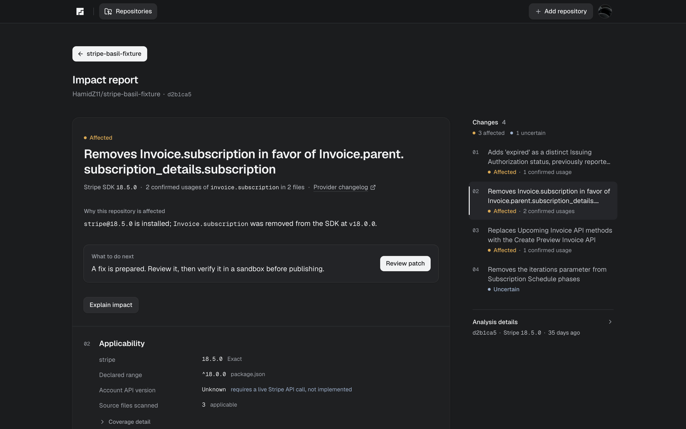
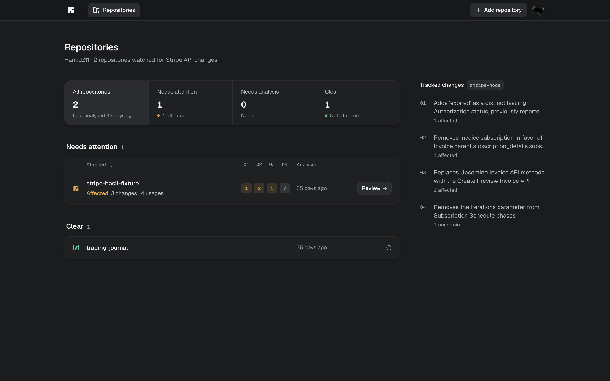
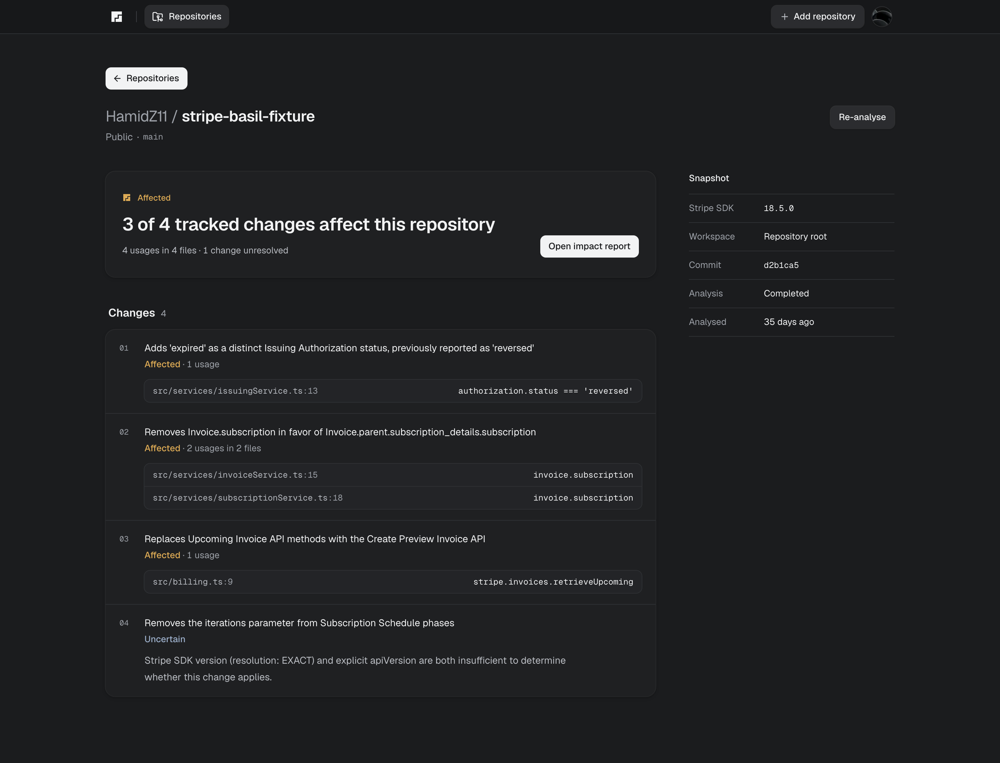
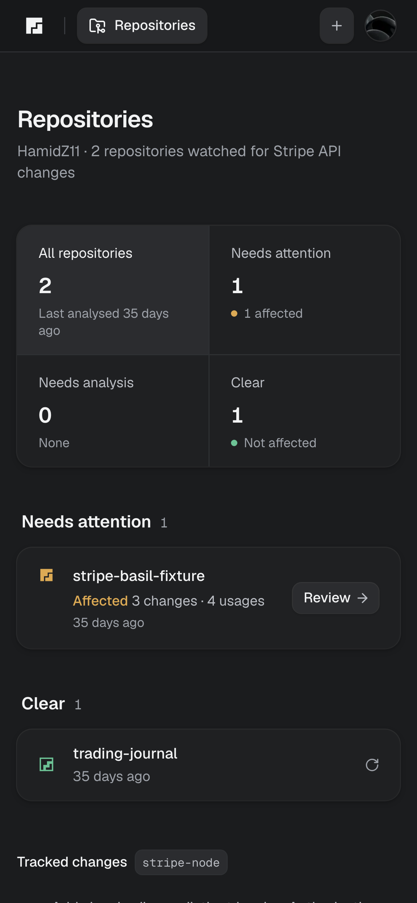
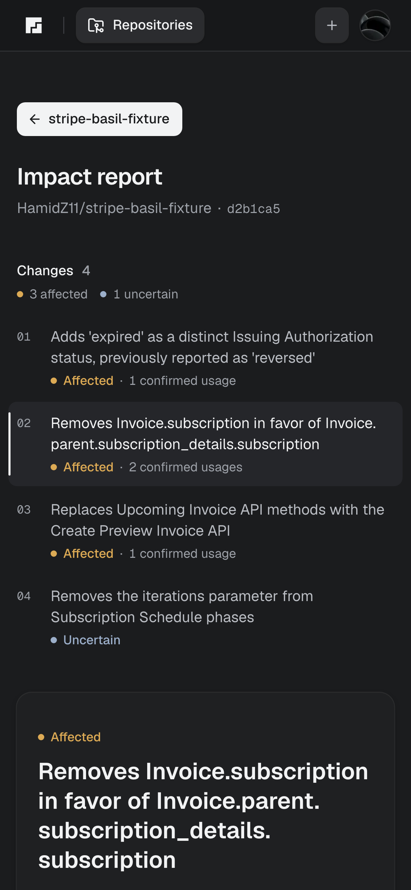
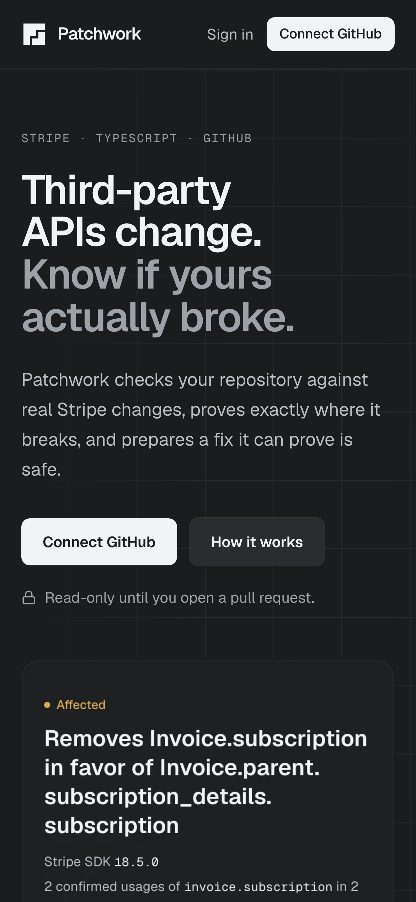
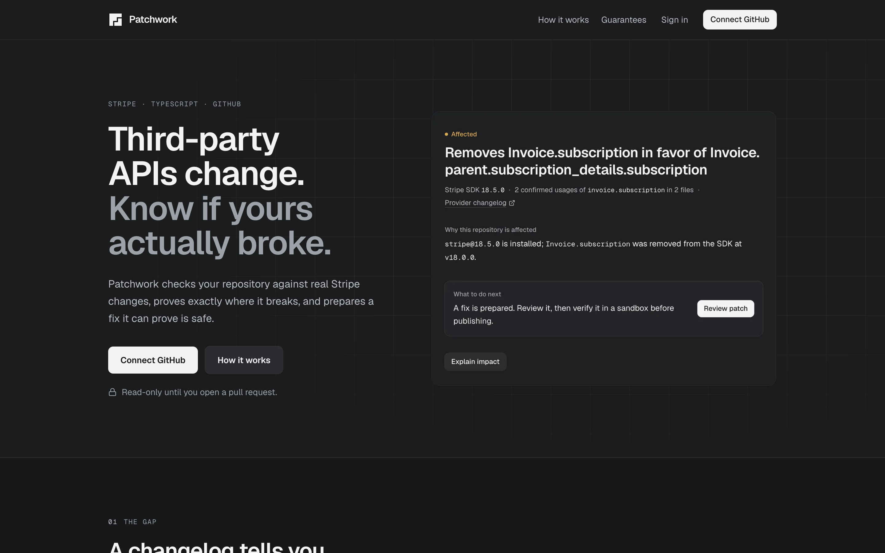
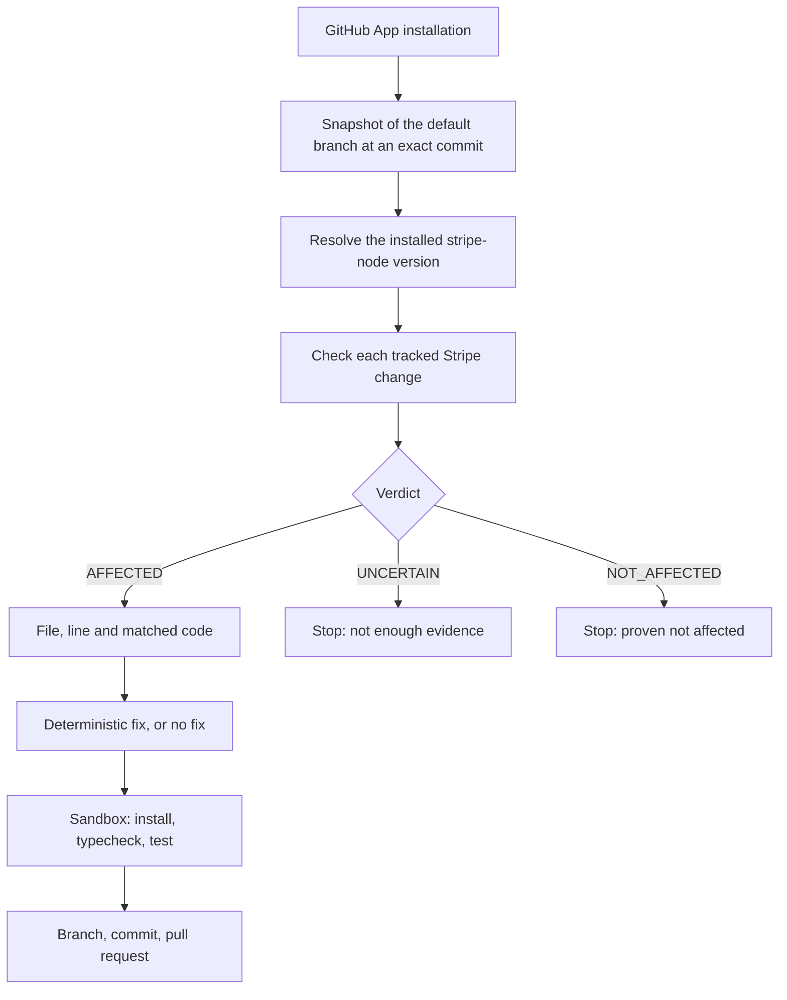
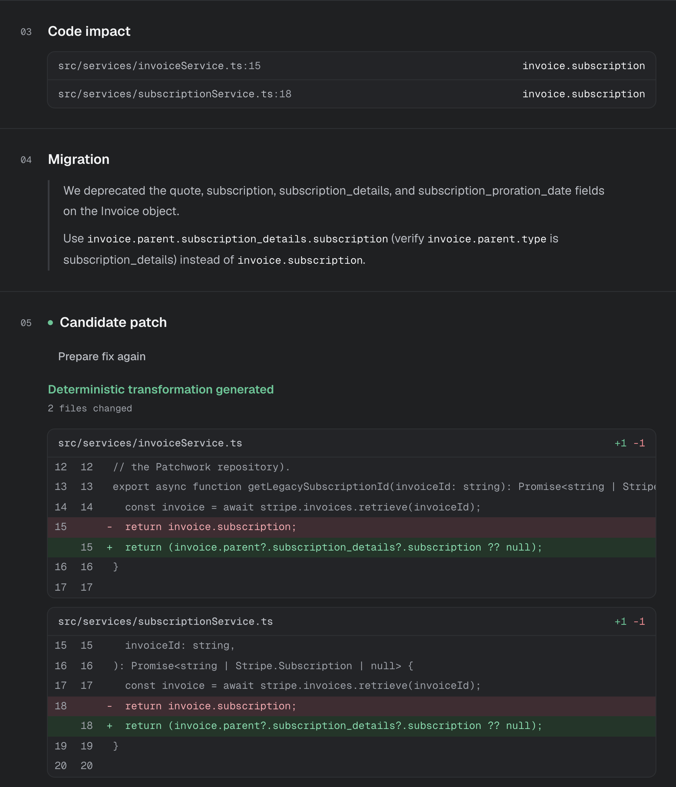
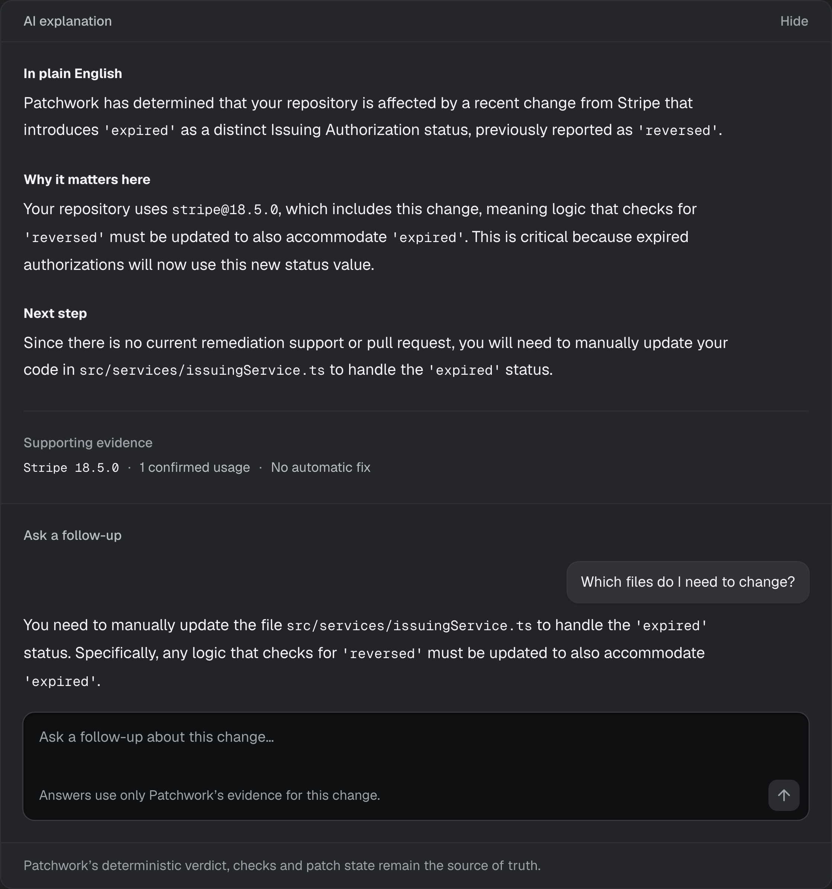

# Patchwork

Patchwork checks whether a third-party API change breaks your code. It finds the exact lines that
use the changed API, rewrites them when it can prove the rewrite is safe, runs your build and tests
in a sandbox, and opens a pull request.

Supports GitHub, Stripe and TypeScript (`stripe-node`), one repository at a time.



## What it answers

A provider changelog tells you what changed. Patchwork tells you, for your repository:

- whether you use the affected API,
- where, by file and line,
- whether the version in your lockfile is affected,
- whether the code can be migrated safely,
- whether it still builds and passes its tests after the fix.

## Screenshots

The screenshots show the app analysing a real repository,
[`HamidZ11/stripe-basil-fixture`](https://github.com/HamidZ11/stripe-basil-fixture).

**Repositories.** Each repository against each tracked Stripe change.



**A repository.** The file and line of every affected usage.



**On a phone.**

<p align="center">
  
  &nbsp;
  
  &nbsp;
  
</p>

**Landing page.**



## How it differs from Dependabot

Dependabot bumps dependency versions. Patchwork checks whether a specific API change affects the
code you have, shows where, and fixes it.

Unlike a general coding agent, Patchwork does not let a language model decide what is affected or
write the fix. Static analysis does both. The model only explains the result.

## How it works


```mermaid
flowchart TD
    A[GitHub App installation] --> B[Snapshot of the default branch at an exact commit]
    B --> C[Resolve the installed stripe-node version]
    C --> D[Check each tracked Stripe change]
    D --> E{Verdict}
    E -->|AFFECTED| F[File, line and matched code]
    E -->|UNCERTAIN| Z[Stop: not enough evidence]
    E -->|NOT_AFFECTED| Y[Stop: proven not affected]
    F --> G[Deterministic fix, or no fix]
    G --> H[Sandbox: install, typecheck, test]
    H --> I[Branch, commit, pull request]
```

## Impact analysis

Each analysis runs against one exact commit.

1. **Version.** The `stripe-node` version comes from the lockfile, not the range in `package.json`.
2. **Search.** A text search finds candidate usages.
3. **Proof.** The TypeScript compiler (`Program` / `TypeChecker`) confirms each candidate really is
   the affected API.
4. **Verdict.** `AFFECTED`, `NOT_AFFECTED` or `UNCERTAIN`.

`AFFECTED` needs a confirmed usage. `NOT_AFFECTED` needs proof the change does not apply. Anything
Patchwork cannot resolve, such as an unknown version or dynamically built code, is `UNCERTAIN`. It
never guesses either way.

The rules are tested against a benchmark of test fixtures, ordinary production code patterns, and
reconstructions of real public repositories from just before their Stripe migration. It runs as part
of `pnpm test`, and CI fails on any wrong `NOT_AFFECTED` or any verdict given without evidence.

## Fixes

Fixes are rewritten by static analysis, not by a model:

```ts
// before
return invoice.subscription;

// after
return invoice.parent?.subscription_details?.subscription ?? null;
```

If Patchwork cannot prove a rewrite keeps the same behaviour for that exact code, it makes no change
at all rather than a partial one.



One of the four rules has a fix today. The other three were assessed and have no safe mechanical
rewrite; the reasons are in
[`apps/api/src/remediation/registry.ts`](apps/api/src/remediation/registry.ts).

## Verification and pull requests

The fixed code runs in an isolated E2B sandbox: `install`, `typecheck` and `test`, using the
repository's own lockfile, config and test command. A pull request can only be opened after that run
passes. A step that did not run is shown as not run.

Patchwork creates a branch from the analysed commit and opens a pull request as the Patchwork GitHub
App. It never merges or deploys.

## AI explanations



On request, an AI explanation describes a verdict in plain English, and you can ask follow-up
questions. The model only sees a small summary of what Patchwork already found, never your source
files or credentials. It cannot change a verdict, claim a check ran, or say a fix exists when it
does not. Follow-up conversations are not stored.

Explanations are optional. Without `OPENAI_API_KEY`, everything else works.

## Architecture

A modular monolith with three processes ([ADR-001](docs/adr/0001-modular-monolith-processes.md)).

```
apps/
  web/      Next.js: landing page and product UI
  api/      Fastify: auth, GitHub, analysis, impact, fixes, explanations
  worker/   Background jobs: sandbox verification and pull requests

packages/
  config/   Validated environment configuration
  db/       PostgreSQL access (Drizzle) and migrations
  github/   GitHub App auth and API client
  archive/  Safe repository archive extraction
```

Background jobs use a PostgreSQL queue (`SELECT … FOR UPDATE SKIP LOCKED`), not Redis.

Repository code only ever runs in the sandbox, never in the API or worker. The sandbox gets no
GitHub token, database credentials or API keys. See [docs/security.md](docs/security.md).

## Tech stack

| Area         | Choice                                                               |
| ------------ | -------------------------------------------------------------------- |
| Frontend     | Next.js 16, React 19, Tailwind CSS 4, TypeScript                     |
| API          | Fastify 5, TypeScript, Zod                                           |
| Data         | PostgreSQL 16, Drizzle ORM                                           |
| Analysis     | TypeScript Compiler API (`Program` / `TypeChecker`)                  |
| Sandbox      | E2B                                                                  |
| Integrations | GitHub App (OAuth + installation tokens), OpenAI (explanations only) |
| Tooling      | pnpm workspaces, Turborepo, Vitest, ESLint, Prettier, GitHub Actions |

## Limitations

- GitHub only.
- Stripe only, with four tracked changes.
- TypeScript and `stripe-node` only.
- One repository analysed at a time.
- One of the four changes has an automatic fix.
- No merging or deploying. Patchwork stops at an open pull request.
- Analysis follows code within a module. Cases that need deeper data flow are `UNCERTAIN`.

## Local development

Requires Node.js ≥ 22.13, pnpm 11.24 (via `corepack enable`), and Docker for PostgreSQL.

```bash
cp .env.example .env
pnpm install
docker compose up -d postgres
pnpm db:migrate
pnpm dev
```

`apps/web` runs on http://localhost:3000, `apps/api` on http://localhost:3001, and `apps/worker` has
no HTTP port.

Signing in needs a real GitHub App; see
[docs/github-integration.md](docs/github-integration.md#manual-github-app-setup). The API and worker
refuse to start with missing or invalid configuration.

| Variable                                                                                                    | Required by | Notes                                                      |
| ----------------------------------------------------------------------------------------------------------- | ----------- | ---------------------------------------------------------- |
| `DATABASE_URL`                                                                                              | all         | PostgreSQL connection string                               |
| `GITHUB_APP_ID`, `GITHUB_APP_SLUG`, `GITHUB_CLIENT_ID`, `GITHUB_CLIENT_SECRET`, `GITHUB_PRIVATE_KEY_BASE64` | api, worker | GitHub App credentials                                     |
| `WEB_APP_URL`                                                                                               | api         | Redirect after sign-in and install                         |
| `E2B_API_KEY`                                                                                               | worker      | Sandbox verification; the worker will not start without it |
| `OPENAI_API_KEY`                                                                                            | —           | Optional. Without it, explanations are unavailable         |
| `OPENAI_EXPLANATION_MODEL`                                                                                  | —           | Optional, defaults to `gpt-4o-mini`                        |
| `NODE_ENV`, `API_PORT`, `LOG_LEVEL`, `SESSION_COOKIE_DOMAIN`, `API_URL`                                     | —           | Optional, with defaults                                    |

## Commands

```bash
pnpm dev          # web, api and worker
pnpm test         # every package, via Turborepo
pnpm benchmark    # impact-analysis benchmark
pnpm lint
pnpm typecheck
pnpm build
pnpm format
```

## Testing

- Unit tests for analysis, version resolution, fixes and diffs.
- API integration tests against a real PostgreSQL database, including access control: another
  user's repository returns 404.
- Worker tests for the sandbox and pull requests, against a fake GitHub repository.
- Frontend component tests.
- The impact-analysis benchmark, which must report zero wrong `NOT_AFFECTED` results and zero
  verdicts given without evidence.

No test makes a real network call: GitHub, the sandbox and OpenAI are replaced with fakes. Database
tests need a running, migrated PostgreSQL; see [docs/testing.md](docs/testing.md).

## Documentation

| Document                                           | Contents                                |
| -------------------------------------------------- | --------------------------------------- |
| [docs/product.md](docs/product.md)                 | Problem, scope and product decisions    |
| [docs/architecture.md](docs/architecture.md)       | System architecture                     |
| [docs/impact-analysis.md](docs/impact-analysis.md) | Impact analysis and how it is evaluated |
| [docs/data-model.md](docs/data-model.md)           | Domain model and persistence            |
| [docs/security.md](docs/security.md)               | Threat model and trust boundaries       |
| [docs/verification.md](docs/verification.md)       | Sandbox verification                    |
| [docs/testing.md](docs/testing.md)                 | Testing strategy                        |
| [DESIGN.md](DESIGN.md)                             | Frontend design rules                   |
| [docs/adr/](docs/adr/)                             | Architecture decision records           |
| [docs/portfolio-demo.md](docs/portfolio-demo.md)   | Demo walkthrough                        |
